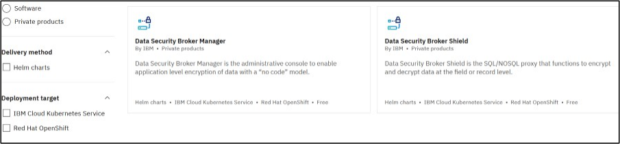
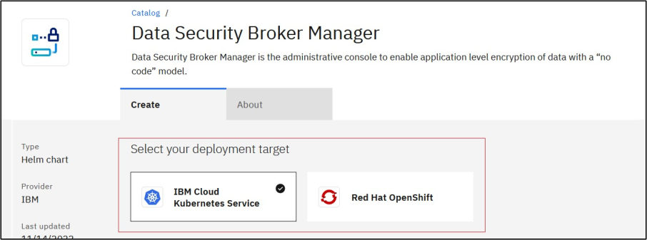

---
copyright:
  years: 2022, 2023
lastupdated: "2023-02-21"

keywords: install, ROKS, IKS, manifests, HELM

subcollection: security-broker

---

{{site.data.keyword.attribute-definition-list}}

# Install {{site.data.keyword.security_broker_short}} Manager
{: #sb_install_catalog}

## Overview
{: #sb_install_ui_overview}

Access the {{site.data.keyword.cloud_notm}} catalog to install the {{site.data.keyword.security_broker_short}} Manager.

You can install {{site.data.keyword.security_broker_short}} Manager and {{site.data.keyword.security_broker_short}} Shield only in classic clusters.
{: important}

## Pre-requisites:
{: #sb_install_ui_prereq}

-   User must be able to access the {{site.data.keyword.cloud_notm}} Kubernetes cluster (IKS) or {{site.data.keyword.redhat_openshift_full}} Kubernetes (ROKS) cluster.

## Procedure
{: #sb_install_ui_procedure}

1. Log into the IBM Cloud Account (https://cloud.ibm.com) with a valid username and password.

2. Click **Catalog** and enter **{{site.data.keyword.security_broker_short}}** in the **Catalog**
    search text box. The {{site.data.keyword.security_broker_short}} components appear in the Catalog.
   
3. To sort the catalog products using the type, click **Software** in the **Type** option, which is present in the left-hand navigation.

4. The {{site.data.keyword.security_broker_short}} software comprises of two components, which is displayed in the Catalog list as **{{site.data.keyword.security_broker_short}} Manager** and **{{site.data.keyword.security_broker_short}} Shield**.

   {: caption="{{site.data.keyword.security_broker_short}} components in IBM Cloud Catalog list" caption-side="bottom"}

5. You must install the **{{site.data.keyword.security_broker_short}} Manager** first and then get the Shield Sync ID from the application in the **{{site.data.keyword.security_broker_short}} Manager** to install the **{{site.data.keyword.security_broker_short}} Shield**.

## Install **{{site.data.keyword.security_broker_short}} Manager**
{: #sb_install_dsbm}

Complete the following steps to install the **{{site.data.keyword.security_broker_short}} Manager** from the {{site.data.keyword.cloud_notm}} catalog:

1. Click **{{site.data.keyword.security_broker_short}} Manager** catalog item.

2. The {{site.data.keyword.security_broker_short}} Manager catalog item opens in a seperate window. In the **Select your deployment target** drop down, select **{{site.data.keyword.containerlong}} (IKS)** or **Red Hat Openshift (ROKS)** to install the {{site.data.keyword.security_broker_short}} Manager in the IKS or ROKS cluster.

   {: caption="{{site.data.keyword.security_broker_short}} Manager" caption-side="bottom"}

3. The delivery method is selected as **HELM chart** by default under the **Select a delivery method** drop down.

4. Select the version of the software to install, in the **Select Version** drop-down.

5. From the list of available clusters, select the cluster on which you wish to perform the installation.

   {: caption="List of clusters" caption-side="bottom"}

6. Select an existing namespace to deploy the {{site.data.keyword.security_broker_short}} Manager or click **Add namespace** to add a new namespace. Specify the name for the namespace and click **Add** to create a new namespace within the selected cluster.

7. Configure your workspace by specifying the following details:

a. Specify the **Name** for the workspace. The workspace name must be unique and using the name of the workspace, you can manage, update or uninstall {{site.data.keyword.security_broker_short}} Manager from the [IBM Schematicss Workspace](https://cloud.ibm.com/schematics/workspaces).

   {: caption="Configure Workspace" caption-side="bottom"}

b. Select the **Resource group**, **Location**, and specify the **Tags** required for configuring the workspace.

8.  lick **Install** in the **Summary** pane on the right to complete the installation process.

9. You will be navigated to the {{site.data.keyword.bpshort}} Workspace to track the installation progress. Once the installation is successful, a message **Workspace creation successfull** is displayed as shown below:

   {: caption="Installation of {{site.data.keyword.security_broker_short}} Manager" caption-side="bottom"}
   
   If you get an error message saying,  **Workspace creation failed**, refer to the Logs available in the Terraform output.
   {: note}

## Next Steps
{: #install-catalog-next steps}

After installing {{site.data.keyword.security_broker_short}} Manager, follow the steps listed below in the flow diagram to configure and setup the {{site.data.keyword.security_broker_short}} Manager:

{: caption="Figure 1. Encyrption flow in {{site.data.keyword.security_broker_short}} Manager" caption-side="bottom"}

