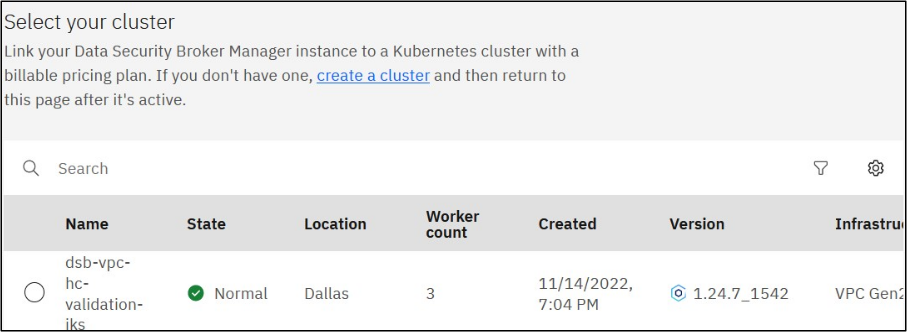

---
copyright:
  years: 2022, 2022
lastupdated: "2021-09-01"

keywords: install, ROKS, IKS, manifests, HELM

subcollection: security-broker
---

# Install Data Security Broker Manager and Data Security Broker Shield
{: #sb_install_catalog}

## Overview:
{: #sb_install_ui_overview}

You can install the {{site.data.keyword.security_broker_short}} software by using the IBM Cloud Catalog. Access the IBM Cloud Catalog to install the {{site.data.keyword.security_broker_short}} Manager and {{site.data.keyword.security_broker_short}} Shield.

## Pre-requisites:
{: #sb_install_ui_prereq}

-   User must have an active IBM Cloud Account

-   User must be able to access the IBM Cloud Kubernetes cluster (IKS)
    or IBM Red Hat OpenShift Kubernetes cluster (ROKS) cluster

## Before you begin
{: #sb-install-before-you-begin}

Before you begin installing the {{site.data.keyword.security_broker_short}} Manager and {{site.data.keyword.security_broker_short}} Shield, verify that you have met the following resource requirements with the help of the sizing guidelines given below:

## Data Security Broker Manager and Data Security Broker Shield Sizing Guidelines
{: #sb_sizing}

The factors that affect the sizing of the {{site.data.keyword.security_broker_short}} deployments consist of the {{site.data.keyword.security_broker_short}} Manager management console and one or more {{site.data.keyword.security_broker_short}} Shield proxies. Each component has its own resource needs depending on the anticipated workloads.

## Data Security Broker Manager ##
{: #sb_sizing_dsbm}

In general, resources allocated to a {{site.data.keyword.security_broker_short}} Manager
deployment needs to be scaled with the number of managed {{site.data.keyword.security_broker_short}} Shields and the number of concurrent users using the {{site.data.keyword.security_broker_short}} Manager.

## Recommended sizing for Kubernetes or OpenShift Deployments: ##
{: #sb_sizing_dsbr}

{{site.data.keyword.security_broker_short}} -manager:

4 CPU, 8 GB Memory

## Data Security Broker Shield ##
{: #sb_sizing_dsbs}

The general rule for {{site.data.keyword.security_broker_short}} Shield sizing, to handle peak
utilization scenarios, is to match the sum of all {{site.data.keyword.security_broker_short}} Shield's memory and CPU allocations to that of the database instance.
The initial vCPU and memory requests for the pod installation can start
low and can be scaled up based on utilization, based on pod scaling
policies, and depending on the workload in a particular installation.
Resource allocation to {{site.data.keyword.security_broker_short}} Shield deployments typically
scales with the expected maximum number of concurrent connections.

## Recommended sizing for Kubernetes or OpenShift Deployments ##
{: #sb_sizing_dsbrs}

{{site.data.keyword.security_broker_short}} Shield consists of a single container that runs in
its own pod. The {{site.data.keyword.security_broker_short}} Shield pod can be in the same or
different cluster but must have network connectivity to {{site.data.keyword.security_broker_short}} Manager.

{{site.data.keyword.security_broker_short}} -shield:

4 CPU, 8 GB Memory

## Procedure:
{: #sb_install_ui_procedure}

1.  Log into the IBM Cloud Account (https://cloud.ibm.com) with a valid username and password.

2.  Click **Catalog** and enter **{{site.data.keyword.security_broker_short}}** in the **Catalog**
    search text box. The {{site.data.keyword.security_broker_short}} components appear in the Catalog.
   
3.  To sort the catalog products using the type, click **Software** in the **Type** option, which is present in the left-hand navigation.

4.  The Data Security Broker software comprises of two components, which is displayed in the Catalog list as **{{site.data.keyword.security_broker_short}} Manager** and **{{site.data.keyword.security_broker_short}} Shield**.

    {: caption="{{site.data.keyword.security_broker_short}} components in IBM Cloud Catalog list" caption-side="bottom"}

5. You must install the **{{site.data.keyword.security_broker_short}} Manager** first and then get the Shield Sync ID from the application in the **{{site.data.keyword.security_broker_short}} Manager** to install the **{{site.data.keyword.security_broker_short}} Shield**.

## Install **{{site.data.keyword.security_broker_short}} Manager**:
{: #sb_install_dsbm}

Complete the following steps to insall the **{{site.data.keyword.security_broker_short}} Manager** from the IBM Cloud Catalog:

1.  Click **{{site.data.keyword.security_broker_short}} Manager** catalog item.

2.  The {{site.data.keyword.security_broker_short}} Manager catalog item opens in a seperate window. In the **Select your deployment target** drop down, select **IBM Cloud Kubernetes service (IKS)** or **Red Hat Openshift (ROKS)** to install the {{site.data.keyword.security_broker_short}} Manager in the IKS or ROKS cluster.

    {: caption="{{site.data.keyword.security_broker_short}} Manager Catalog Page" caption-side="bottom"}

3.  The delivery method is selected as **HELM chart** by default under the **Select a delivery method** drop down.

4.  Select the version of the software to install, in the **Select Version** drop-down.

5.  From the list of available clusters, select the cluster on which you wish to perform the installation.

    {: caption="List of clusters" caption-side="bottom"}

6.  Select an existing namespace to deploy the {{site.data.keyword.security_broker_short}} Manager or click **Add namespace** to add a new namespace. Specify the name for the namespace and click **Add** to create a new namespace within the selected cluster.

7.  Configure your workspace by specifying the following details:

a.  Specify the **Name** for the workspace. The workspace name must be unique and using the name of the workspace, you can manage, update or uninstall {{site.data.keyword.security_broker_short}} Manager from the IBM Schematics Workspace (https://cloud.ibm.com/schematics/workspaces).

    {: caption="Configure Workspace" caption-side="bottom"}

b.  Select the **Resource group**, **Location**, and specify the **Tags** required for configuring the workspace.

8.  Click **Install** in the **Summary** pane on the right to complete the installation process.

9. You will be navigated to the IBM Schematics Workspace to track the installation progress. Once the installation is successful, a message **Workspace creation successfull** is displayed as shown below:

    {: caption="Installation of {{site.data.keyword.security_broker_short}} Manager" caption-side="bottom"}

**Note**: If you get an error message saying,  **Workspace creation failed**, refer to the Logs available in the Terraform output.

## Configure **{{site.data.keyword.security_broker_short}} Manager**:
{: #install-catalog-configure}

You must configure the {{site.data.keyword.security_broker_short}} Manager console before installing the {{site.data.keyword.security_broker_short}} Shield. See [Configure {{site.data.keyword.security_broker_short}} Manager](/docs/security-broker?topic=security-broker-sb_configure) to complete the configuration of the {{site.data.keyword.security_broker_short}} Manager and access the {{site.data.keyword.security_broker_short}} Manager console.

## Login to **{{site.data.keyword.security_broker_short}}** Manager:
{: #install-catalog-login}

Login to the {{site.data.keyword.security_broker_short}} Manager using the steps mentioned in the [Logging into {{site.data.keyword.security_broker_short}} Manager](/docs/security-broker?topic=security-broker-sb_login) section. 

## Enroll an application in the **{{site.data.keyword.security_broker_short}}** Manager:
{: #install-catalog-enroll}

Refer to the [Enrolling an Application in {{site.data.keyword.security_broker_short}} Manager](/docs/security-broker?topic=security-broker-sb_enroll_app) section to enroll an application in the {{site.data.keyword.security_broker_short}} Manager.

## Install **{{site.data.keyword.security_broker_short}}** Shield:
{: #sb_install_ui_procedure}

Complete the following steps to insall the {{site.data.keyword.security_broker_short}} Shield from the IBM Cloud Catalog:

1.  Click **{{site.data.keyword.security_broker_short}} Shield** catalog item.

2.  In the **Select your deployment target** drop down, select **IBM Cloud Kubernetes service** or **Red    Hat Openshift** to install the {{site.data.keyword.security_broker_short}} Shield in the IKS or ROKS cluster.

    {: caption="{{site.data.keyword.security_broker_short}} Shield Catalog Page" caption-side="bottom"}

3.  The delivery method is selected as **HELM chart** by default under the **Select a delivery method** drop down.

4.  Select the version of the software to install, in the **Select Version** drop-down.

5.  From the list of available clusters, select the cluster on which you wish to perform the installation.

    {: caption="List of clusters" caption-side="bottom"}

6.  Select an existing namespace to deploy the {{site.data.keyword.security_broker_short}} Shield or click **Add namespace** to add a new namespace. Specify the name for the namespace and click **Add** to create a new namespace within the selected cluster.

7.  Configure your workspace by specifying the following details:

    a.  Specify the **Name** for the workspace. The workspace name must be unique and using the name of the workspace, you can manage, update or uninstall {{site.data.keyword.security_broker_short}} Shield from the IBM Schematics Workspace (https://cloud.ibm.com/schematics/workspaces).
    {: caption="Configure Workspace" caption-side="bottom"}
    b.  Select the **Resource group**, **Location**, and specify the **Tags** required for configuring the workspace. 

8. Copy the Shield Sync ID from the {{site.data.keyword.security_broker_short}} Manager application.

    {: caption="Shield Sync ID from Application" caption-side="bottom"}

9. Provide the Shield Sync ID and Shield name under **Set the Input Variables** section. 

**Note**: Shield Name is mandatory if you are installing multiple Shields.

    {: caption="Shield Sync ID" caption-side="bottom"}

10. Click **Install** in the **Summary** pane on the right to complete the installation process.

11. You will be navigated to the IBM Schematics Workspaces to track the installation progress. Once the installation is successful, a message **Workspace creation successfull** is displayed as shown below:

    {: caption="Installation of {{site.data.keyword.security_broker_short}} Shield" caption-side="bottom"}

**Note**: If you get an error message like **Workspace creation failed**, refer to the Logs available in the Terraform output.

**Next steps**:

Once you have successfully installed {{site.data.keyword.security_broker_short}} Shield, you can explore the data protection services in the {{site.data.keyword.security_broker_short}} Manager.

Refer to the [Data Protection Services](/docs/security-broker?topic=security-broker-sb_encrypt_postgress) section to perform the data protection services offered by {{site.data.keyword.security_broker_short}} Manager.

