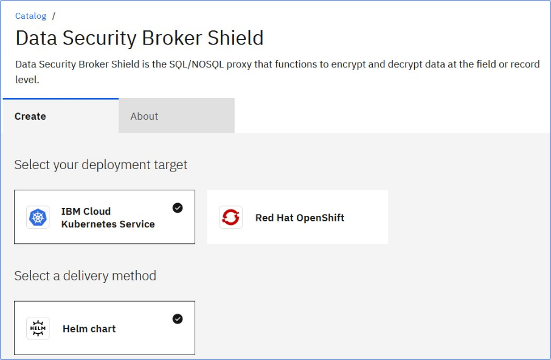
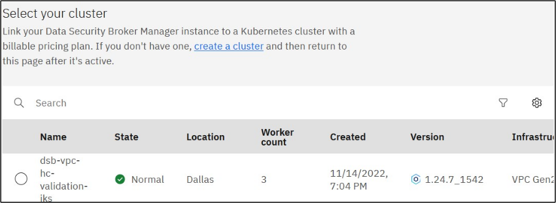
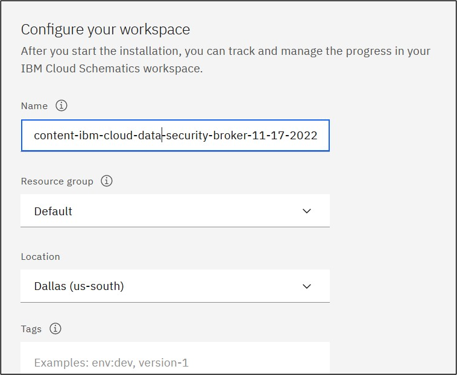
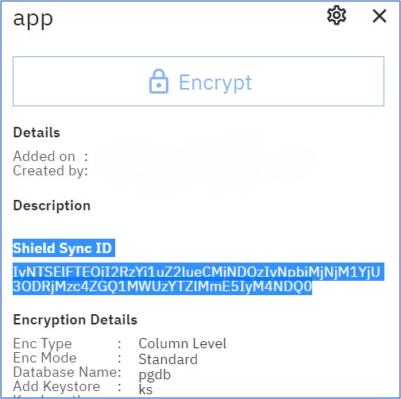
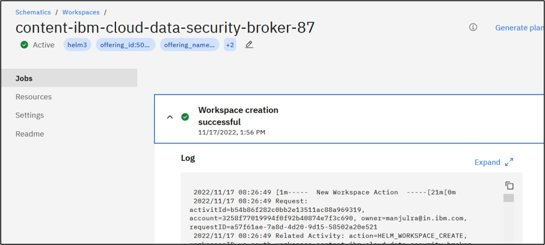

---
copyright:
  years: 2022, 2023
lastupdated: "2023-06-13"

keywords: install, ROKS, IKS, manifests, HELM

subcollection: security-broker
---

{{site.data.keyword.attribute-definition-list}}

# Install {{site.data.keyword.security_broker_short}} Shield
{: #sb_ui_procedure}

Once you have the completed setting up the {{site.data.keyword.security_broker_short}} Manager, the next step is to install the {{site.data.keyword.security_broker_short}} Shield. Copy the **Shield Sync ID** from the {{site.data.keyword.security_broker_short}} Manager application, to use during the {{site.data.keyword.security_broker_short}} Shield installation.
{: important}

Complete the following steps to install the {{site.data.keyword.security_broker_short}} Shield from the {{site.data.keyword.cloud}} Catalog:

1. Click **{{site.data.keyword.security_broker_short}} Shield** catalog item.

2. In the **Select your deployment target** drop down, select **{{site.data.keyword.containerlong_notm}}** or **Red    Hat Openshift** to install the {{site.data.keyword.security_broker_short}} Shield in the IKS or ROKS cluster.

   {: caption="{{site.data.keyword.security_broker_short}} Shield Catalog Page" caption-side="bottom"}

3. The delivery method is selected as **HELM chart** by default under the **Select a delivery method** drop down.

4. Select the version of the software to install, in the **Select Version** drop-down.

5. From the list of available clusters, select the cluster on which you wish to perform the installation.

   {: caption="List of clusters" caption-side="bottom"}

6. Select an existing namespace to deploy the {{site.data.keyword.security_broker_short}} Shield or click **Add namespace** to add a new namespace. Specify the name for the namespace and click **Add** to create a new namespace within the selected cluster.

7. You must run the preinstallation script by clicking on the **Run Script** button after you select the cluster and the namespace. If you do not run the preinstallation script, you cannot proceed with the installation of the {{site.data.keyword.security_broker_short}} Manager.

8. Configure your workspace by specifying the following details:

   a. Specify the **Name** for the workspace. The workspace name must be unique and using the name of the workspace, you can manage, update or uninstall {{site.data.keyword.security_broker_short}} Shield from the IBM Schematicss Workspace (https://cloud.ibm.com/schematics/workspaces).

   {: caption="Configure Workspace" caption-side="bottom"}

   If you are installing more than one instance of {{site.data.keyword.security_broker_short}} Manager in the same namespace, ensure that you provide unique workspace names to each of the {{site.data.keyword.security_broker_short}} Manager installation. Otherwise, you might get error which describes that the same workspace already exists in the namespace.
   {: note}
    
   b. Select the **Resource group**, **Location**, and specify the **Tags** required for configuring the workspace. 

9. Copy the Shield Sync ID from the {{site.data.keyword.security_broker_short}} Manager application.

   {: caption="Shield Sync ID from Application" caption-side="bottom"}

10. Set the input variables. Provide the Shield Sync ID and Shield name and specify the values for the other required parameters as per the description.

   Shield Name is mandatory if you are installing multiple Shields.
   {: note}

11. Click **Install** in the **Summary** pane on the right to complete the installation process.

12. You will be navigated to the IBM Schematicss Workspaces to track the installation progress. Once the installation is successful, a message **Workspace creation successfull** is displayed as shown below:

    {: caption="Installation of {{site.data.keyword.security_broker_short}} Shield" caption-side="bottom"}

If you get an error message like **Workspace creation failed**, refer to the Logs available in the Terraform output.
{: note}

## Next steps
{: #sb_install_ui_procedure_nextsteps}

Once you have successfully installed {{site.data.keyword.security_broker_short}} Shield, you can refer to the [Data Encryption Services](/docs/security-broker?topic=security-broker-sb_encrypt_postgress) section to encrypt data.
