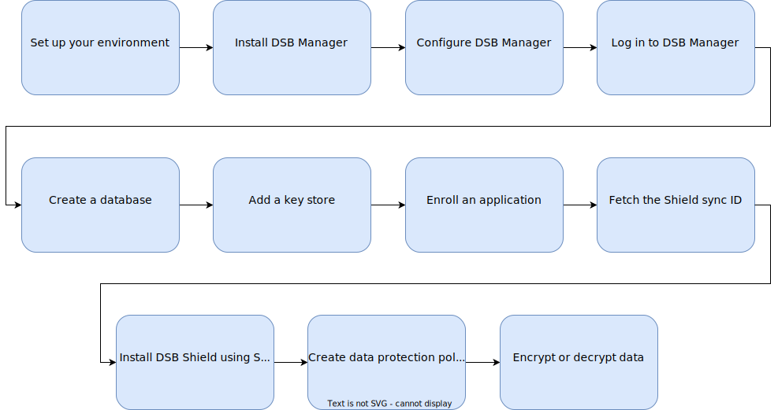

---
copyright:
  years: 2023
lastupdated: "2023-08-23"

keywords: about the service, deploy policy, deployment plans, encryption technology, encryption modes, data protection modes

subcollection: security-broker
---

{{site.data.keyword.attribute-definition-list}}

# How does IBM Cloud Security and Compliance Center Data Security Broker work?
{: #overview}

{{site.data.keyword.security_broker_short}} delivers an enterprise-level transparent data security platform that secures databases through a "no code" model at the field or file level. 
The software supports tokenization, format-preserving encryption (FPE), and role-based access control. 

The encyrption is made simpler, faster, and seamless.

{: caption="High level architecture of {{site.data.keyword.security_broker_short}} Manager" caption-side="center"}

The {{site.data.keyword.security_broker_short}} supports data encryption by migrating the data from an existing SQL database into a secure database with the ability to encrypt fields at a column granularity, thereby enabling selective privacy.

This is accomplished by inserting the {{site.data.keyword.security_broker_short}} Shield driver
layer proxy between the application and the database. The Shield is used to intercept SQL equivalent generated by the application to access data records in the database by encrypting on writes and decrypting on reads.

The encryption process manages keys that are generated by a commercially available key management service such as {{site.data.keyword.keymanagementservicelong}} and {{site.data.keyword.hscrypto}}. 

Application performance is minimally impacted allowing for enterprise workflows to continue to operate in a secure environment.

## Next Steps
{: #overview-next steps}

Now that you have an understanding of the various entities that exist within {{site.data.keyword.security_broker_short}}, and how do they work together, the following diagram details the user flows that you might take when you are working with {{site.data.keyword.security_broker_short}}.

{: caption="Figure 1. User Workflow" caption-side="bottom"}