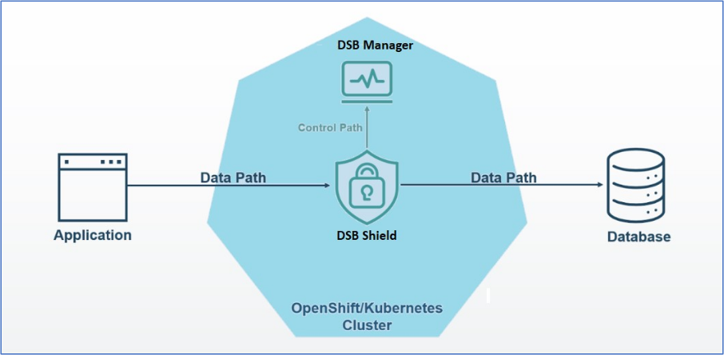

---
copyright:
  years: 2022, 2023
lastupdated: "2023-06-14"

keywords: support, backup, high availability

subcollection: security-broker
---

{{site.data.keyword.attribute-definition-list}}

# Understanding High Availability for IBM Cloud Data Security Broker
{: #sb_ha}

{{site.data.keyword.security_broker_short}} components can be deployed in an environment with highly available configuration to minimize or eliminate the downtime caused by momentary failures of {{site.data.keyword.security_broker_short}} components or the infrastructure they depend on, ensuring the continuous availability of data protected by {{site.data.keyword.security_broker_short}} Data encryption services. The high volume of data access during peak load periods that can result from deployment in a highly available configuration can also help mitigate service degradations.

## Overview of High Availability Architecture
{: #sb_ha_overview}

A management server connects to the proxies and manages their configuration and settings, and proxies are placed in the data paths between applications and data stores as part of the {{site.data.keyword.security_broker_short}} Data Encryption service. Figure 1 shows the control path, which is made up of the management servers and the connections between the proxies and the management servers.

{: caption="Figure 1: Control path vs data path" caption-side="center"}

The data path's proxies can function without maintaining a constant connection to the management server. Furthermore, deployments rarely involve changing configuration and policy settings. With a much stricter availability requirement for the proxies than the management server, this means that the availability requirement for data path components and control path components can differ.

{{site.data.keyword.security_broker_short}} typically advises using {{site.data.keyword.security_broker_short}} Shields to achieve consistent availability with the database it is protecting. Shields must typically be installed in as many regions and availability zones as the database. To take advantage of the dynamic routing and scaling features provided by the framework, {{site.data.keyword.security_broker_short}} also advises customers to deploy {{site.data.keyword.security_broker_short}} components in a Kubernetes or {{site.data.keyword.redhat_openshift_notm}} environment.

{{site.data.keyword.security_broker_short}} suggests maintaining a standby {{site.data.keyword.security_broker_short}} Manager instance with regular metadata synchronization for organizations that needs to shorten the time it takes to restore access to a {{site.data.keyword.security_broker_short}} Manager instance.

## Deploying {{site.data.keyword.security_broker_short}} Shields for High Availability
{: #sb_ha_deploy}

{{site.data.keyword.security_broker_short}} recommends deploying in Kubernetes or OpenShift clusters for use cases that demand high availability. You can find details on the {{site.data.keyword.security_broker_short}} Shields deployments in Kubernetes or {{site.data.keyword.redhat_openshift_notm}} environment.

## Deploy across regions
{: #sb_ha_deploy_regions}

Every {{site.data.keyword.security_broker_short}} Shields is typically deployed in a cluster as its own pod. It is not necessary for the Shield to have a constant connection to {{site.data.keyword.security_broker_short}} Manager. To retrieve the configuration and data security policy information and to update configuration or policies, the Shields are needed to communicate with {{site.data.keyword.security_broker_short}} Manager during initial registration. This helps to deploy the {{site.data.keyword.security_broker_short}} Shields with little to no network proximity requirements.

As a result, {{site.data.keyword.security_broker_short}} Shields must be installed in Kubernetes or {{site.data.keyword.redhat_openshift_notm}} clusters across a number of different geographical areas for a deployment that aims to achieve maximum availability. One active {{site.data.keyword.security_broker_short}} Manager can still control every Shield deployed across all of the different regions as shown in Figure 2.

{: caption="Figure 2: High availability deployment architecture of {{site.data.keyword.security_broker_short}}" caption-side="center"}

For applications in each region, one or more load balancers must be set up with routing rules that direct traffic to the shield connection with the lowest latency.

## Horizontal Pod Autoscaling (HPA) Configuration
{: #sb_ha_deploy_hpa}

{{site.data.keyword.security_broker_short}} advises using horizontal pod scaling for each cluster to increase service availability within the cluster. {{site.data.keyword.security_broker_short}} Shield's deployment cluster's HorizontalAutoscaler (HPA) feature can be used to configure horizontal scaling. Based on the proper resource utilization, this HPA can be configured. The HPA configuration described in the following YAML file supports scaling for increased cluster availability. {{site.data.keyword.security_broker_short}} recommends boosting the **maxReplica** setting to a value appropriate for the anticipated peak load in order to scale and handle the large peak loads. It is recommended to allocate the same number of CPUs to the database server's CPUs as you would do for the maximum number of replicas.

```sh
apiVersion: autoscaling/v2beta2
kind: HorizontalPodAutoscaler
metadata:
  name: {{site.data.keyword.security_broker_short}}-pg-shield-hpa
spec:
  scaleTargetRef:
    apiVersion: apps/v1
    kind: Deployment
    name: {{site.data.keyword.security_broker_short}}-pg-shield
  minReplicas: 1
  maxReplicas: 2
  metrics:
    - type: Resource
      resource:
        name: cpu
        target:
          type: Utilization
          averageUtilization: 75
    - type: Resource
      resource:
        name: memory
        target:
          type: Utilization
          averageUtilization: 75
```
{: codeblock}

## Deploying {{site.data.keyword.security_broker_short}} Manager for High Availability
{: #sb_ha_dsbm}

Currently, {{site.data.keyword.security_broker_short}} Manager supports a high availability deployment that is active-passive. To configure and manage {{site.data.keyword.security_broker_short}} Shields across all regions for a specific application, administrators can only use a single instance of {{site.data.keyword.security_broker_short}} Manager.

The metadata kept by the {{site.data.keyword.security_broker_short}} Manager instance must regularly be backed up from the primary instance and restored to the standby instance in order to guarantee that the metadata for the primary and standby {{site.data.keyword.security_broker_short}} Managers remain consistent. To perform the backup and recovery procedures required to synchronize the {{site.data.keyword.security_broker_short}} Manager instances, see [Disaster recovery for IBM Cloud Data Security Broker](/docs/security-broker?topic=security-broker-sb_dr).

## Synchronization Frequency
{: #sb_ha_sf}

In order to configure data encryption policies or audit current policies, service availability requirements determine how frequently the active and standby {{site.data.keyword.security_broker_short}} Managers synchronize. Typically, these are rare occurrences, and a job that automatically synchronizes metadata between the primary and standby must be adequate.

The synchronization job between the primary and standby {{site.data.keyword.security_broker_short}} Managers must be run after each configuration change if you do not wish for configuration loss.

## Deploying Across Regions
{: #sb_ha_dr_regions}

The standby {{site.data.keyword.security_broker_short}} Manager instance must be deployed in a different geographic region than the primary {{site.data.keyword.security_broker_short}} Manager instance in order to maximize availability of {{site.data.keyword.security_broker_short}} Manager in the event of any outage. It is not necessary for the two {{site.data.keyword.security_broker_short}} Manager instances to be directly connected to one another, but they must both have access to a common backup repository where the backup files used to synchronize the two instances are kept.

To ensure that {{site.data.keyword.security_broker_short}} Shields are aware of both the primary and standby {{site.data.keyword.security_broker_short}} Manager instance, follow the steps below:

1. The IP address of the deployment of the standby {{site.data.keyword.security_broker_short}} Manager must be configured in the primary {{site.data.keyword.security_broker_short}} Manager's **Proxy_Access** parameter.

2. The primary {{site.data.keyword.security_broker_short}} Manager deployment's IP address must be entered in the **BM_IP** parameter for the Helm Chart that is used to deploy {{site.data.keyword.security_broker_short}} Shield.

Ensure that you add and configure the Application in {{site.data.keyword.security_broker_short}} Manager after completing High availability configuration.
{: note}

