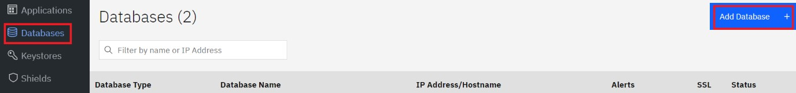

---
copyright:
  years: 2022, 2022
lastupdated: "2021-09-01"

keywords: database, admin, priveleges, users, features, operations, application

subcollection: security-broker
---

## Connecting to a Datastore
{: #sb_add_db}

To add and connect to a data store, complete the following steps in the {{site.data.keyword.security_broker_short}} Manager:

1. Login to {{site.data.keyword.security_broker_short}} Manager.

2.  Select **Databases** from the left navigation and click **Add
    Database +** to add a data store.

3.  In the **Add Database** dialog, enter a name and description for the
    database in the **Database Name** and **Database Description**
    fields.

{: caption="Figure 2. Connecting to a Database" caption-side="bottom"}

4.  Select the database type as **Postgres** from the **Database Type**
    drop-down list.

5.  Enter the IP address of the database in the **Hostname or IP
    Address** field.

6.  Specify the **Port** for the database and enter the user **Database
    Username** and **Database Credential**.

**Note**:

-   Create a new user on your database for use with IBM Cloud Security
    Broker. For more information, see **Database Privileges** (Provide
    link to Database Privileges topic).

-   For IBM Cloud use a **Postgres** database and enter your database
    name in the **Postgres Database Name** field.

7.  Optional: Select **Use SSL**, click **Add file**, and upload an SSL
    Certificate.

8.  Click **Add Database** to complete enrolment. The new database
    appears in the list of configured databases.

9.  Create the data that is required for encryption or decryption as
    tables in the new database that is created.
