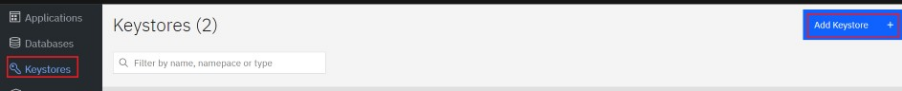

---
copyright:
  years: 2022, 2022
lastupdated: "2021-09-01"

keywords: database, admin, priveleges, users, features, operations, application

subcollection: security-broker
---

# Adding Keystore in {{site.data.keyword.security_broker_short}} Manager
{: #sb_add_keystore}

Before you can enroll your applications, add databases, and enable encryption, you must enroll your Keystore, so that the {{site.data.keyword.security_broker_short}} Manager can access and create data encryption keys (DEKs) that is used to protect your data. 
    
Follow the steps below to enroll a Keystore that you can use with {{site.data.keyword.security_broker_short}} Shields and databases.

1. Login to {{site.data.keyword.security_broker_short}} Manager.

2. Select **Keystores** from the left navigation and click **Add Keystore +**.

{: caption="Figure 1. Keystores" caption-side="bottom"}

3. Specify a **Keystore name** and provide a valid **Description**.

4. Select the Keystore Type from the **Keystore Type** dropdown menu. 
    Enter values for the **Instance ID**, **App Namespace**, **IBM Key Protect Alias**, and **IAM API Key**. Select the region in the **IBM Region** drop down and choose the Data
    Encryption Key (DEK) Storage type from the **DEK Storage Type** drop down. For information on how to create encryption keys, see [Creating and importing encryption
    keys](https://cloud.ibm.com/docs/key-protect?topic=key-protect-tutorial-import-keys).

**Note**: Keystore parameters are specific to each Keystore type or
vendor. 

For more information on configuring the IBM Key Protect and configuring the IBM Cloud Hyper Protect Crypto Services (HPCS), refer to the [Configure IBM Key Protect and HPCS](/docs/security-broker?topic=security-broker-sb_configure_Keyprotect) section.

5. Click **Add Keystore** to create a Keystore.

6. Once you have completed adding a keystore, the next step is to enroll an application. Refer to the [Enrolling an Application in {{site.data.keyword.security_broker_short}} Manager](/docs/security-broker?topic=security-broker-sb_enroll_app) section to enroll an application in the {{site.data.keyword.security_broker_short}} Manager.

