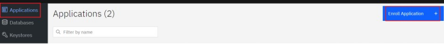
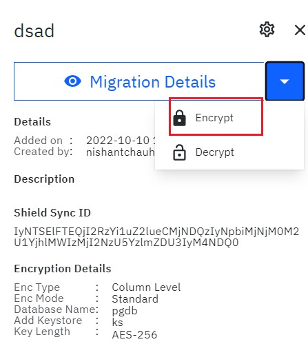
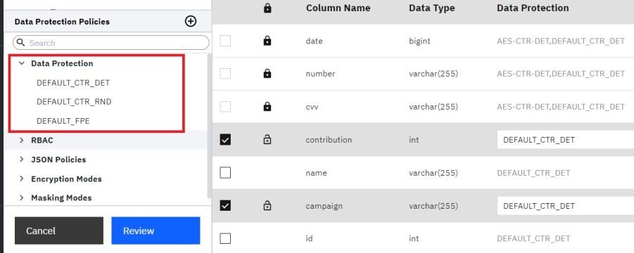

---
copyright:
  years: 2022, 2022
lastupdated: "2022-10-11"

keywords: database, admin, priveleges, users, features, operations

subcollection: security-broker
---

# Assigning or changing a Default Data Protection Policy
{: #sb_assign_policy}

## Overview:
{: #sb_assign_overview}

A Data Protection Policy consists of a combination of encryption modes
and masking rules. Default Data Protection Policies allow you to
apply default settings for encryption, Format Preserving Encryption
(FPE), or Data Masking, A policy is applied to the columns of a data
store associated with an application enrolled in {{site.data.keyword.security_broker_short}}
Manager and linked to a {{site.data.keyword.security_broker_short}} Shield. 

A list of Default Data Protection Policies is available in the Data
Protection Library at the bottom of the left navigation bar. Click the
carrot icon **(\<)** to expand and view the list of list **Default Data
Protection Policies, Encryption Modes, and Masking Modes.**

## To assign or change a Default Data Protection Policy, do the following:
{: #sb_encrypt_steps}

1.  In {{site.data.keyword.security_broker_short}} Manager, click the **Application** icon in
    the left menu bar.

{: caption="Figure 1. Applications" caption-side="bottom"}

2.  Select an application from the list and click **Encrypt**.

{: caption="Figure 2. Encrypt Data" caption-side="bottom"}

3.  In the left navigation menu, navigate to a database and schema and
    select the table for which you want to assign or change a policy.
    The table appears on the right.

4.  Click the checkbox for a column and then expand the **Data Protection** drop-down list. By default,     CTR Policy is selected.

{: caption="Figure 3. Data Protection Policies" caption-side="bottom"}

5.  Perform one of the following operations:
    - Accept the default policy or select a different default policy.
    - Specify a new default policy and add an encryption or masking mode.

**Note**: Default Policy rules are **overwritten** by individual mode
selections. However, because the Default FPE policy contains only
encryption modes, and the Default Masking Policy contains only Masking
modes, selecting the opposite mode will not affect the default policy.
For example: 

-   If you select Default FPE and any Mask Mode, both are applied to
    that column.

-   If you select Default FPE and any other FPE mode, (like FPE-cc), the
    FPE-cc option **overwrites the** Default FPE option for that
    column. 

6.  Select a **Key ID** from the drop-down menu or accept the default.

7.  Click **REVIEW** at the bottom of the left panel to review your
    selections.

8.  Review your policy and select a **Migration Plan**. The migration plans are listed below:
    **Save Policy**: Defines a policy for future migration.
    **Deploy Policy**: Establishes a data schema for an environment that was not processed through {{site.data.keyword.security_broker_short}} migration and the data type conversion but does not migrate the data.
    **Deploy Policy & Migrate Data**: Defines a policy *and* migrates the
    existing data in the data store.
