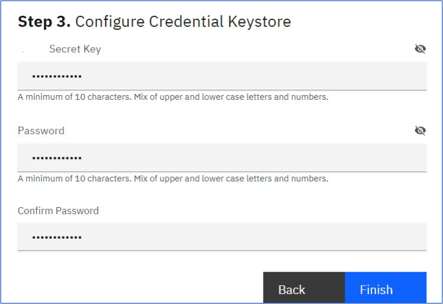

---
copyright:
  years: 2022, 2022
lastupdated: "2022-11-29"

keywords: database, admin, priveleges, users, configure, operations

subcollection: security-broker
---

# Configure Data Security Broker Manager
{: #sb_configure}

Configuring the {{site.data.keyword.security_broker_short}} Manager console is the first step
in implementing the data protection services.

## **Prerequisites:**
{: #sb_configure_prereq}

Before you begin configuring {{site.data.keyword.security_broker_short}} Manager, ensure you meet the
following requirements:

    1. {{site.data.keyword.security_broker_short}} Manager must have been installed.
    2. Load Balancer URL is required to access the {{site.data.keyword.security_broker_short}} Manager.


## To configure {{site.data.keyword.security_broker_short}} Manager, perform the following steps:
{: #sb_configure_overview}

1. To obtain the **Load_balancer_url** from the Terraform output, perform the following steps:

    a. Navigate to the IBM CLI and execute the following command, provided that you are aware of the workspace name that you provided during the {{site.data.keyword.security_broker_short}} Manage install.

    ```sh
    export LOADBALANCER_IP=$(kubectl get svc dsb-nginx  --namespace <namespace name> -o jsonpath='{.status.loadBalancer.ingress[0].ip}')

    echo "https://$LOADBALANCER_IP"
    ```
    {: codeblock}    

    **Note**: If you are not sure about the workspace name that you have used during the {{site.data.keyword.security_broker_short}} Manager install, fetch the export command from the Terraform output of the workspace from the IBM Schematics Workspace (https://cloud.ibm.com/schematics/workspaces) and execute it in the IBM CLI.

2. Copy the **load_balancer_url** from the IBM CLI.
3. Open a browser window and paste the **load_balancer_url** in the following format:

    ```sh
    https://<load balancer url>
    ```
    {: codeblock}    

    The warning **Your connection is not private** is disaplayed.

    {: caption="Warning: Connection not private" caption-side="bottom"}

4. Click **Advanced**, and click the **Proceed to link** at the bottom of the page.

5. The **Getting Started** dialog to proceed with the configuration of the {{site.data.keyword.security_broker_short}} Manager appears as shown below:

    {: caption="Getting Started" caption-side="bottom"}

6. Configure the basic System Settings by entering the hostname, domain name, proxy access, and click **Continue**.

7. Create an Admin Account for the initial {{site.data.keyword.security_broker_short}} Manager administrator by specifying the email address in the **Configure Super Admin User** page. This account is   used to configure the subsequent components such as the keystore, data store connections, and {{site.data.keyword.security_broker_short}} Shields. Click **Continue**.

    {: caption="Configure Super Admin User" caption-side="bottom"}

8. Configure Credential Keystore to establish an encrypted credential store for any system access credential or access key that the {{site.data.keyword.security_broker_short}} Manager or {{site.data.keyword.security_broker_short}} Shield utilize. Enter the **{{site.data.keyword.security_broker_short}}** **Secret Key** in the text field. For the **Password** field, enter a secure password or passphrase to secure the actual keystore. Enter the same string that you specified for the **Password** field in the **Confirm Password** text box. Click **Finish** to complete the {{site.data.keyword.security_broker_short}} Manager configuration.

    {: caption="Configure Credential Keystore" caption-side="bottom"}

    **Note**: The {{site.data.keyword.security_broker_short}} Secret Key must contain at least 10 characters, a mixture of upper and lower case, including at least one numeric character. The Secret Key is used to generate a random key to encrypt the Keystore Config Password.

9. Login to the **{{site.data.keyword.security_broker_short}}** Manager using the steps mentioned in the [Logging into {{site.data.keyword.security_broker_short}} Manager](/docs/security-broker?topic=security-broker-sb_login) section.
