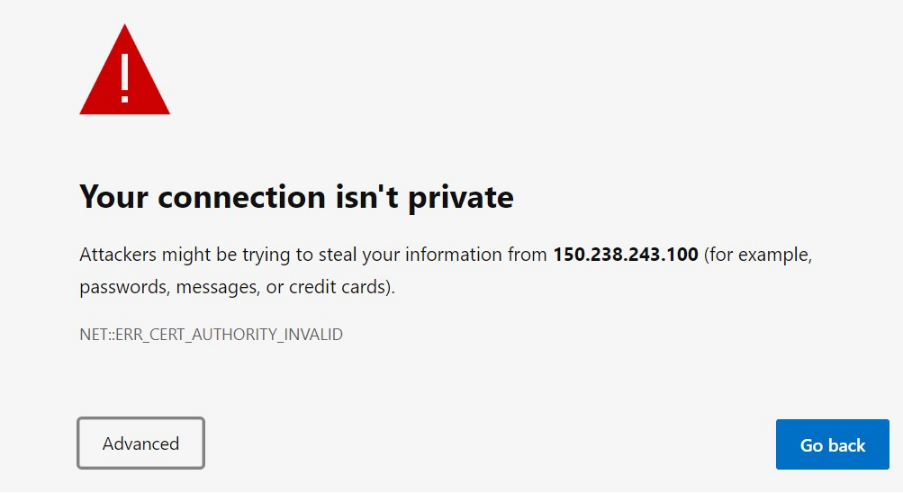
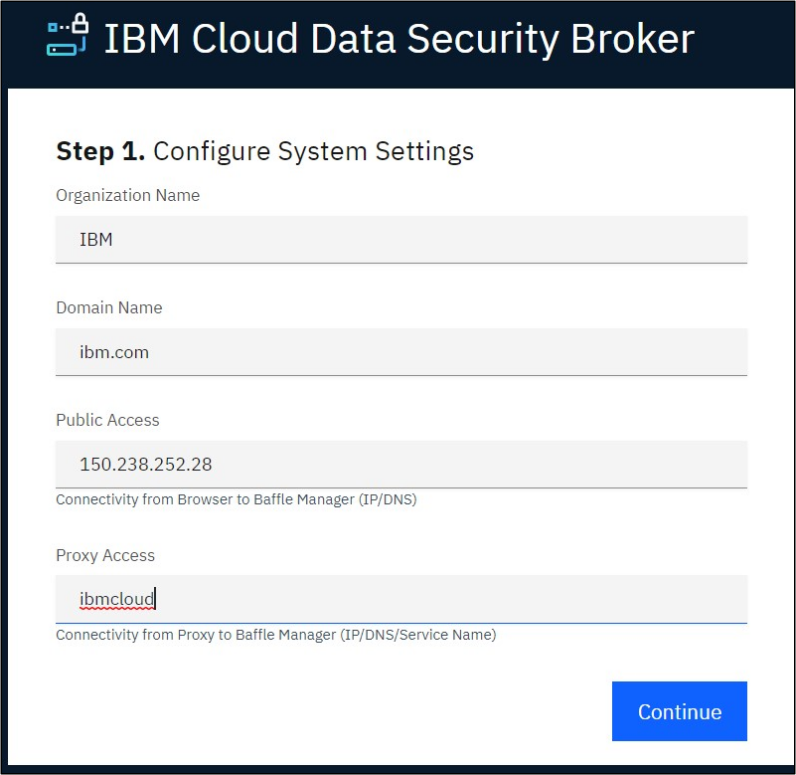
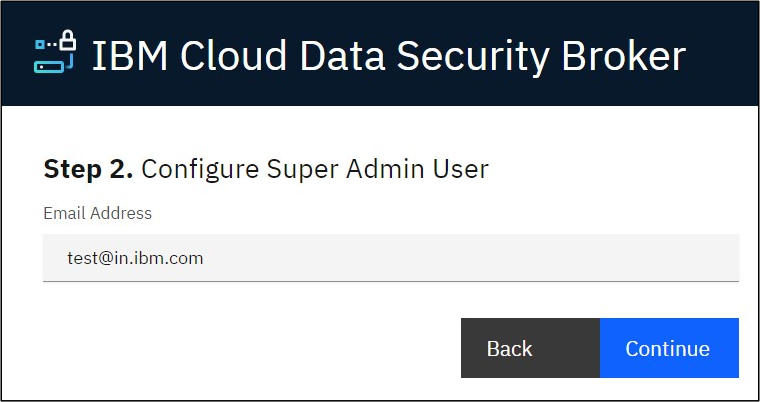

---
copyright:
  years: 2022, 2022
lastupdated: "2022-11-22"

keywords: database, admin, priveleges, users, configure, operations

subcollection: security-broker
---

# Configure Data Security Broker Manager
{: #sb_configure}

Configuring the {{site.data.keyword.security_broker_short}} Manager console is the first step
in implementing the data protection services.

## **Prerequisites:**
{: #sb_configure_prereq}

Before you begin configuring {{site.data.keyword.security_broker_short}}, ensure you meet the
following requirements:

1.  Create IBM Keys Authentication -- For more information, see
    [Creating and importing encryption
    keys](https://cloud.ibm.com/docs/key-protect?topic=key-protect-tutorial-import-keys).

2.  Create a Cloud Object Store (COS) -- For more information, see
    the [IBM Cloud Object
    Storage](https://www.ibm.com/cloud/object-storage).

## To configure {{site.data.keyword.security_broker_short}} Manager, perform the following steps:
{: #sb_configure_overview}

1.  Make a note of the **load_balancer_url** from the Terraform output of the {{site.data.keyword.security_broker_short}} install.
2.  Open a browser window and enter the **load_balancer_url** from the Terraform output in the following format:

```sh
https://<load balancer url>
```
{: codeblock}    
The warning **Your connection is not private** is disaplayed.

{: caption="Warning: Connection not private" caption-side="bottom"}

3.  Click **Advanced**, and click the **Proceed to link** at the bottom of the page.

4.  The **Getting Started** dialog to proceed with the configuration of the {{site.data.keyword.        security_broker_short}} Manager appears as shown below:

{: caption="Getting Started" caption-side="bottom"}

5.  Configure the basic System Settings by entering the hostname, domain name, proxy access, and click **Continue**.

6.  Create an Admin Account for the initial {{site.data.keyword.security_broker_short}} Manager administrator by specifying the email address in the **Configure Super Admin User** page. This account is   used to configure the subsequent components such as the keystore, data store connections,
and {{site.data.keyword.security_broker_short}} Shields. Click **Continue**.

{: caption="Configure Super Admin User" caption-side="bottom"}

8.  Configure Credential Keystore to establish an encrypted credential store for any system access credential or access key that the {{site.data.keyword.security_broker_short}} Manager or {{site.data.keyword.security_broker_short}} Shield utilize. Enter the **{{site.data.keyword.security_broker_short}}** **Secret Key** in the text field. 

**Note**: The {{site.data.keyword.security_broker_short}} Secret Key must contain at least 10 characters, a mixture of upper and lower case, including at least one numeric character. The Secret Key is used to generate a random key to encrypt the Keystore Config Password. For the **Password** field, enter a secure
password or passphrase to secure the actual keystore. Enter the same string that you specified for the **Password** field in the **Confirm Password** text box. Click Finish to complete the {{site.data.keyword.security_broker_short}} Manager configuration.

9. Login to the **{{site.data.keyword.security_broker_short}}** Manager using the steps mentioned in the [Logging into {{site.data.keyword.security_broker_short}} Manager](/docs/security-broker?topic=security-broker-sb_login) section.
