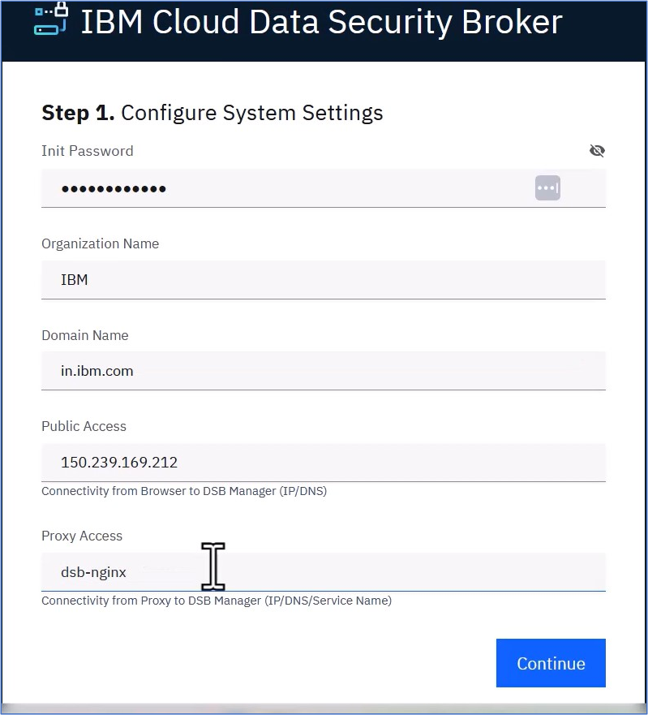

---
copyright:
  years: 2022, 2022
lastupdated: "2023-02-10"

keywords: database, admin, priveleges, users, configure, operations

subcollection: security-broker
---

# Configure {{site.data.keyword.security_broker_short}} Manager
{: #sb_configure}

Configuring the {{site.data.keyword.security_broker_short}} Manager console is the first step
to login and implement the data protection services.

## **Prerequisites:**
{: #sb_configure_prereq}

Before you begin configuring {{site.data.keyword.security_broker_short}} Manager, ensure you meet the
following requirements:

- {{site.data.keyword.security_broker_short}} Manager must have been installed.
- Load Balancer URL is required to access the {{site.data.keyword.security_broker_short}} Manager.


## To configure {{site.data.keyword.security_broker_short}} Manager, perform the following steps:
{: #sb_configure_overview}

1.  To obtain the **Load_balancer_url** of the **dsb-nginx** service, perform the following steps. 
 
    - Log into your IBM Cloud account.
    
    - Select **Resource List** from the left navigation menu. Click **Containers** to view the list of clusters.

    - Select the cluster where you have installed the {{site.data.keyword.security_broker_short}} Manager instance.

    **{{site.data.keyword.containerlong}} (IKS)**:

    - If you have installed the {{site.data.keyword.security_broker_short}} Manager in a Kubernetes cluster, click **Kubernetes Dashboard** to navigate to the Kubernetes Dashboard from the cluster.
 
    - Select the namespace from the drop-down, on which you have installed the {{site.data.keyword.security_broker_short}} Manager.

    - Navigate to **Services** to view the list of {{site.data.keyword.security_broker_short}} Manager services running in the namespace.

    - Fetch the **LoadBalancer IP** from the **External Endpoints** column for the **dsb-nginx** service.

    **Red Hat Openshift (ROKS)**:

    - If you have installed the {{site.data.keyword.security_broker_short}} Manager in a Red Hat Openshift cluster, click **Openshift web console** from the cluster.

    - Click **Projects** in the left navigation menu and select the project from the drop-down, on which you have installed the {{site.data.keyword.security_broker_short}} Manager.

    - Navigate to **Networking -> Routes** to view the list of {{site.data.keyword.security_broker_short}} Manager services running in the project.

    - Fetch the **{{site.data.keyword.security_broker_short}} Manager URL** from the **Locations** column for the **dsb-nginx** service.
    
2.  Copy the **load_balancer_url** from the Kubernetes dashboard for the IKS cluster or from the Openshift web console for the ROKS cluster.
3.  Open a browser window and paste the **load_balancer_url** in the following format:

    ```sh
    https://<load balancer url without the port number>
    ```
    {: codeblock}    

    **Example**:  If the LoadBalancer IP is http://150.238.243.117:443/, specify the IP in the format https://150.238.243.117

    The warning **Your connection is not private** is disaplayed.

    {: caption="Warning: Connection not private" caption-side="bottom"}

4.  Click **Advanced**, and click the **Proceed to link** at the bottom of the page.

5.  The **Getting Started** dialog to proceed with the configuration of the {{site.data.keyword.security_broker_short}} Manager appears as shown below:

    {: caption="Getting Started" caption-side="bottom"}
    
6.  Configure the basic System Settings by entering the hostname, domain name, proxy access, and click **Continue**.

    The domain is part of the email, followed after the "@" character, that is specified during the configuration. For example, if the email specified is **test@example.com**, then the domain name must be specified as **example.com**. 
    The proxy access name is the name that is responsible for the connectivity from Proxy to {{site.data.keyword.security_broker_short}} Manager (the IP, or DNS, or the Service Name). For example, **dsb-nginx**.
    {: note}
    
7. Create an Admin Account for the initial {{site.data.keyword.security_broker_short}} Manager administrator by specifying the email address in the **Configure Super Admin User** page. This account is   used to configure the subsequent components such as the keystore, data store connections, and {{site.data.keyword.security_broker_short}} Shields. Click **Continue**.

    {: caption="Configure Super Admin User" caption-side="bottom"}

8. Configure Credential Keystore to establish an encrypted credential store for any system access credential or access key that the {{site.data.keyword.security_broker_short}} Manager or {{site.data.keyword.security_broker_short}} Shield utilize. Enter the **{{site.data.keyword.security_broker_short}}** **Secret Key** in the text field. For the **Password** field, enter a secure password or passphrase to secure the actual keystore. Enter the same string that you specified for the **Password** field in the **Confirm Password** text box. Click **Finish** to complete the {{site.data.keyword.security_broker_short}} Manager configuration.

    {: caption="Configure Credential Keystore" caption-side="bottom"}

    The {{site.data.keyword.security_broker_short}} Secret Key must contain at least 10 characters, a mixture of upper and lower case, including at least one numeric character. The Secret Key is used to generate a random key to encrypt the Keystore Config Password.
    {: note}

9. Once you complete the configuration process for the {{site.data.keyword.security_broker_short}} Manager, the next step is to login to the {{site.data.keyword.security_broker_short}} Manager using the steps mentioned in the [Logging into {{site.data.keyword.security_broker_short}} Manager](/docs/security-broker?topic=security-broker-sb_login) section.
