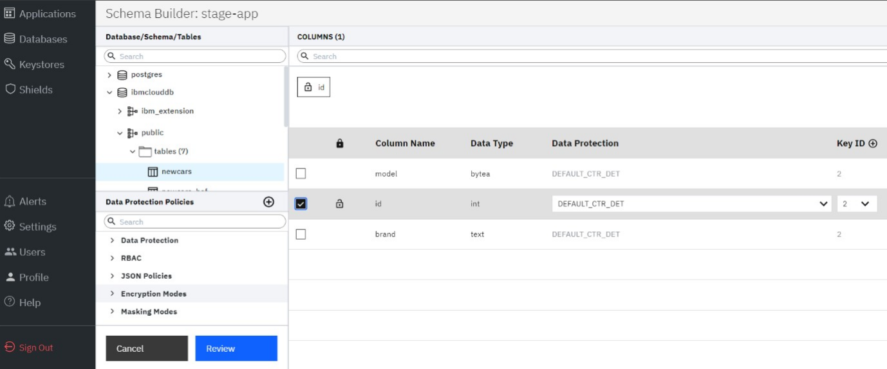

---
copyright:
  years: 2022, 2022
lastupdated: "2023-02-08"

keywords: database, admin, priveleges, users, features, operations

subcollection: security-broker
---

# Data Encryption using IBM Cloud PostgreSQL Database
{: #sb_encrypt_data}

## Overview:
{: #sb_se_overview}

{{site.data.keyword.security_broker_short}} functions as an
application-level encryption (ALE) equivalent in this
mode encrypting data on a field-level basis. This is performed using
{{site.data.keyword.security_broker_short}} Manager to enumerate the data
schema and enable an encryption key mapping.

## Format Preserving Encryption (FPE) Supported Data Types:
{: #sb_encrypt_FPE_data_types}

The following tables lists the FPE supported data types for the data encryption in {{site.data.keyword.security_broker_short}} Manager:

**PostgreSQL**:

| **Original Data Type** | **FPE Data Type**                         |
|------------------------|-------------------------------------------|
| smallint               | fpe-int                                   |
| int                    | fpe-int                                   |
| integer                | fpe-int                                   |
| bigint                 | fpe-int                                   |
| bytea                  | fpe-int                                   |
| numeric                | fpe-decimal                               |
| decimal                | fpe-decimal                               |
| numeric (s,p)          | fpe-decimal                               |
| decimal (s,p)          | fpe-decimal                               |
| money                  | fpe-decimal                               |
| var                    | - fpe-decimal - fpe-alphanum - fpe-latin1 |
| char                   | - fpe-win1252 - fpe-cc                    |
| text                   | - fpe-email1 - fpe-email2                 |
| date                   | fpe-datetime                              |
| time                   | fpe-datetime                              |
| timestamp              | fpe-datetime                              |
| uuid                   | fpe-hexadecimal                           |
{: caption="Table 1. FPE Supported Data Types caption-side="bottom"}

## Counter-Mode (CTR) Supported Data Types:
{: #sb_encrypt_CTR_data_types}

**Note**: {{site.data.keyword.security_broker_short}} Shield only supports one word for a data type name.
**BYTEA** is a PostgreSQL data type that has the capability to store hexadecimal data which is used to store encrypted data. **BYTEA** is an equivalent of **VARBINARY** in **MySQL** or **RAW** datatype in **Oracle** database.

**PostgreSQL**:
The following table lists PostgreSQL supported data types for M_CTR mode in {{site.data.keyword.security_broker_short}} Manager. 

| **Original Data Type**                                                            | **Encrypted Data Type** |   |
|-----------------------------------------------------------------------------------|-------------------------|---|
| SMALLINT                                                                          | BYTEA                   |   |
| INT, INTEGER                                                                      | BYTEA                   |   |
| BIGINT                                                                            | BYTEA                   |   |
| REAL, FLOAT4                                                                      | BYTEA                   |   |
| FLOAT8 - Used in {{site.data.keyword.security_broker_short}} Shield  for "double precision"              | BYTEA                   |   |
| DECIMAL, NUMERIC                                                                  | BYTEA                   |   |
| VARCHAR - Used in {{site.data.keyword.security_broker_short}} Shield for "character verification"        | BYTEA                   |   |
| CHAR, CHARACTER, BPCHAR                                                           | BYTEA                   |   |
| TEXT                                                                              | BYTEA                   |   |
| JSON, JSONB                                                                       | BYTEA                   |   |
| BYTEA                                                                             | BYTEA                   |   |
| MONEY                                                                             | BYTEA                   |   |
| DATE                                                                              | BYTEA                   |   |
| TIMESTAMP - Used in {{site.data.keyword.security_broker_short}} Shield for "timestamp without time zone" | BYTEA                   |   |
| TIMESTAMPZ - Used in {{site.data.keyword.security_broker_short}} Shield for "timestamp with time zone"   | BYTEA                   |   |
| UUID                                                                              | BYTEA                   |   |
| BIT                                                                               | BYTEA                   |   |
| VARBIT - Used in {{site.data.keyword.security_broker_short}} Shield for "bit verification"               | BYTEA                   |   |
{: caption="Table 2. CTR Supported Data Types caption-side="bottom"}

## Procedure:
{: #sb_se_procedure}

Complete the following steps to encrypt the data with {{site.data.keyword.security_broker_short}} Manager on
an IBM Cloud PostgreSQL Database:

1. Login to {{site.data.keyword.security_broker_short}} Manager.
2. Click on an application and select the drop down which is present in
    the **Migration Details** field in the right side and click
    **Encrypt**.
{: caption="Figure 5. Encrypt Data" caption-side="bottom"}

3. Select the Database and the table where you have the data created
    and select the **Column** which needs to be encrypted. Choose the
    **Data Protection** policy, **Encryption mode**, and **masking
    mode** for the encryption process and click **Review.** For more
    details on the encryption and data protection policies, refer to
    **Encryption and Data Protection Modes in Security Broker** section
    (Provide a link to the Encryption and Data Protection Modes in Data
    Security Broker table which is present in the About the service
    topic).

    {: caption="Figure 6. Standard Encryption" caption-side="bottom"}

4. Choose **Deploy Policy & Migrate Data** under the **Deployment
    Plan** option. There are three options that you can choose to
    implement your data encryption policy. For more information on
    Deployment plans, see **Deployment Plans in IBM Cloud Data Security
    Broker (**Provide a link to the deployment plan section present in
    the About the service topic**)**. Select the Security Broker Shield
    service IP address in the **Migration Shield** field and click
    **Save** to start the encryption process.

5. The status of the application shows **Migrating** when the
    encryption process starts.

6. Once the encryption is complete, the status is changed to
    **Protected**. You can view more information by clicking **Migration
    Details** in the **Applications** sidebar.

**Note**: If there is new data which gets inserted in the database, by default, the data is encrypted by using the default data encryption policy that is being selected by the user.

