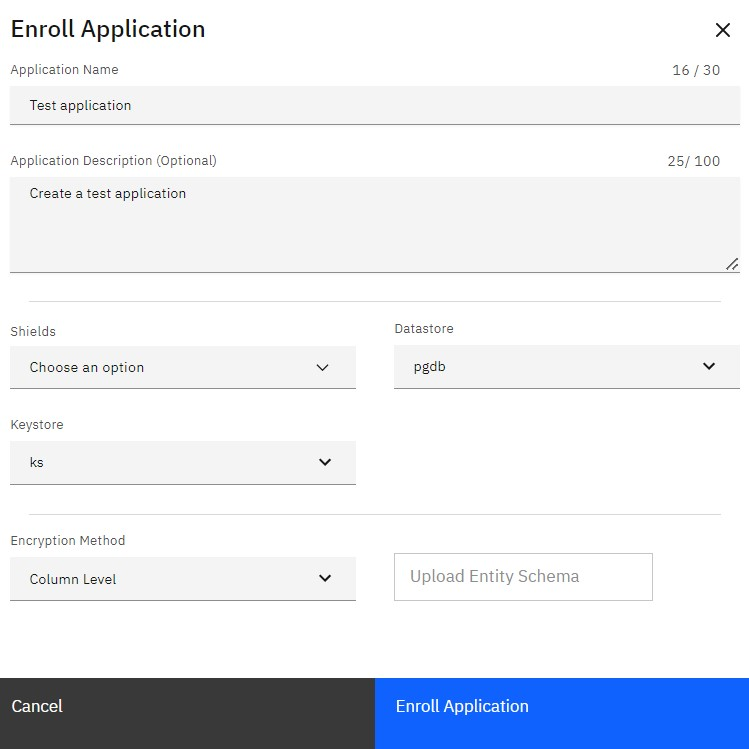

---
copyright:
  years: 2022, 2022
lastupdated: "2022-10-11"

keywords: database, admin, priveleges, users, features, operations, application

subcollection: security-broker
---

# Enrolling an Application in {{site.data.keyword.security_broker_short}} Manager
{: #sb_enroll_app}

An application is the framework that links Security Broker Manager,
databases, and Security Broker Shield and instructs the Security Broker
Shield to encrypt and decrypt data.

**Note**: A {{site.data.keyword.security_broker_short}} Shield is limited to be enrolled with one
application.

To enroll an application in Security Broker Manager, complete the
following steps:

1.  Click the **Applications** icon in the left navigation panel.

{: caption="Figure 1. Applications" caption-side="bottom"}

2.  Click **Enroll Application +** in the upper right corner of the window. The
    Enroll Application dialog appears.

3.  Enter an **Application Name** and **Application Description** in the
    respective fields.

4.  Perform the following tasks:
    - Choose the {{site.data.keyword.security_broker_short}} Shield from the drop-down list.
    - Select a **Data Store** for encryption.
    - Select the **Keystore** to be used as a source for data encryption keys.  
    - Specify an **Encryption Method** as Column Level or Row Level. 

    {: caption="Figure 2. Enroll Application" caption-side="bottom"}

5.  Click **Enroll Application**.
