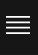

---
copyright:
  years: 2022, 2022
lastupdated: "2021-09-01"

keywords: logging, debugging, platform, dashboard, observability

subcollection: security-broker
---

# Logging and Debugging in {{site.data.keyword.security_broker_short}} Manager
{: #sb_logging}

**Overview**:

This section demonstrates how to enable logging for Data Security
Broker. Use IBM® Log Analysis to add log management capabilities to Data
Security Broker.

The logging agent collects and forwards logs to your IBM Log Analysis
instance. After you provision an IBM® Log Analysis instance, you must
configure a logging agent for each log source that you want to monitor
in {{site.data.keyword.security_broker_short}} Manager. For more information on provisioning a
log instance, see [Logging with IBM Cloud
Services](https://cloud.ibm.com/docs/log-analysis?topic=log-analysis-getting-started).

**Pre-requisites**:

-   You need an IBM Cloud account.

-   You need a **logdna** instance, which is configured to receive
    platform logs.

**Procedure**:

To configure a logging instance from the **Observability** dashboard in
the IBM Cloud, complete the following steps:

1.  Log in to your IBM Cloud account. After you log in, the IBM Cloud UI
    opens.

2.  Go to the menu icon
    {width="0.2611111111111111in"
    height="0.38263888888888886in"} > **Observability** to access the
    **Observability** dashboard.

3.  Click **Logging**, then click **Options** > **Edit Platform**.

4.  Select a region.

5.  Choose which logging instance will receive logs from Data Security
    Broker on that location.

6.  Click **Select** to create the log instance.

After you provision an instance of the IBM Log Analysis service in the
IBM Cloud, and configure a logging agent for a log source, you can view,
monitor, manage log data, and debug the logs through the IBM Log
Analysis Web UI. To debug the logs, follow the steps below:

1.  Log in to your IBM Cloud account. After you log in, the IBM Cloud UI
    opens.

2.  Go to the menu icon
    {width="0.2611111111111111in"
    height="0.38263888888888886in"} > **Observability** to access the
    **Observability** dashboard.

3.  Click **Logging** and select the log instance which you have created
    for the {{site.data.keyword.security_broker_short}}.

4.  Click **Open Dashboard** for the log instance that you have created.
    You can view the detailed log summary in the dashboard as shown
    below:

{width="6.261111111111111in"
height="2.182638888888889in"}

5.  You can start debugging the logs, which are displayed with a
    predefined format. You can also filter logs and modify search
    settings, then bookmark the result as a view.
