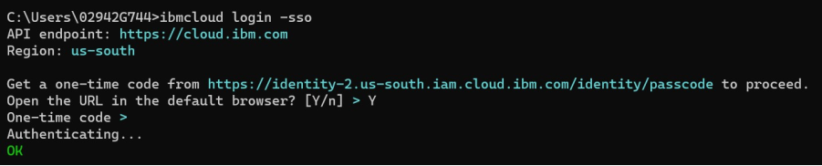
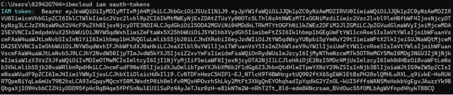
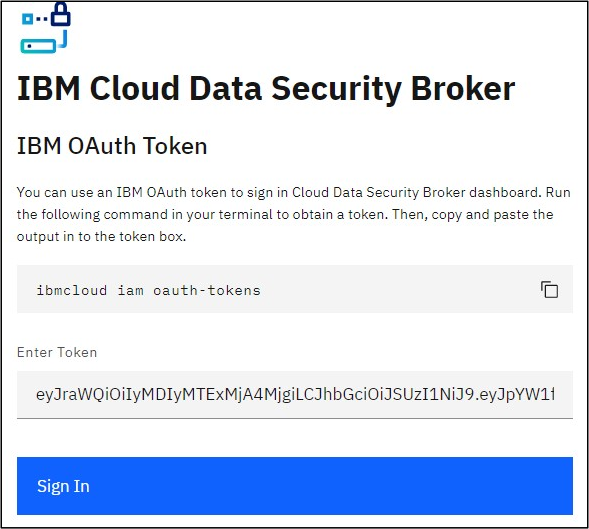

---
copyright:
  years: 2022, 2023
lastupdated: "2023-08-22"

keywords: logging, debugging, platform, dashboard, observability

subcollection: security-broker
---

{{site.data.keyword.attribute-definition-list}}

# Log in to {{site.data.keyword.security_broker_short}} Manager
{: #sb_login}

Once you have configured the {{site.data.keyword.security_broker_short}} Manager, the next step
is log in to the {{site.data.keyword.security_broker_short}} Manager using the OAuth token.

Complete the following steps to log in to the {{site.data.keyword.security_broker_short}} Manager:

1. Generate an IBM OAuth token. To obtain the OAuth token, log in to your {{site.data.keyword.cloud}} account from the Command Line Interface using the following steps:

   a. Open the Command terminal from your system.
   b. Execute the following command to log in to your {{site.data.keyword.cloud_notm}} account:
   ```sh
   ibmcloud login -sso
   ```
   {: pre}

   When prompted to open the one-time passcode in a browser window, specify **Y** for "Yes". You will be re-directed to the browser window, from where you can copy and paste the one-time passcode. 

   Navigate back to the CLI and paste the one-time passcode and select the account in which you wish to log in using your IBM Cloud credentials. 

   {: caption="Log in to IBM Cloud CLI" caption-side="bottom"}

   Ensure that the IBM Cloud account, which is used during the configuration of the {{site.data.keyword.security_broker_short}} Manager as the Super Admin user, and the IBM Cloud account that you are using to log in using the CLI to generate the OAuth token must be the same. Otherwise, you might get an error which says that the OAuth token is invalid.
   {: note}
    
2. Run the following command to generate the OAuth token:
   ```sh
   ibmcloud iam oauth-tokens
   ```
   {: pre}

   {: caption="OAuth token" caption-side="bottom"}

   The **Admin** users that are added to {{site.data.keyword.security_broker_short}} Manager must use the tokens generated in the same {{site.data.keyword.cloud}} account, where the **Super Admin** user resides. {{site.data.keyword.security_broker_short}} Manager does not support cross account access, considering the security risks involved. 
   {: important}

3. Open the {{site.data.keyword.security_broker_short}} Manager console which has already been configured in a browser window. For example, https://150.238.243.117.

4. Copy the OAuth token without any space or additional characters and paste it in the **Enter token** text box as shown below in the Login page and click **Sign In** to log in to the {{site.data.keyword.security_broker_short}} Manager:

   {: caption="Log in to {{site.data.keyword.security_broker_short}} Manager" caption-side="bottom"}
    
5. Once you have logged into the {{site.data.keyword.security_broker_short}} Manager, the next step is add a database, connect to a keystore, and enroll an application to proceed with the data encryption. Refer to the [Data Encryption Services Overview](/docs/security-broker?topic=security-broker-sb_encrypt_progress) section to proceed with the data encryption services.

