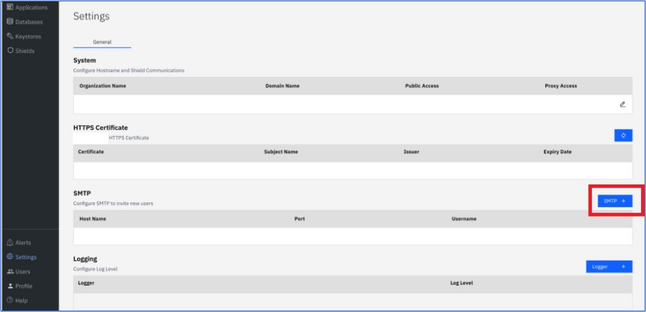
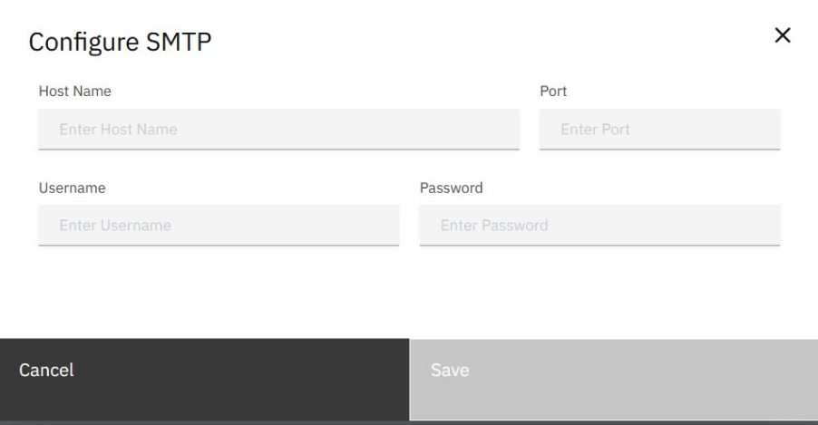
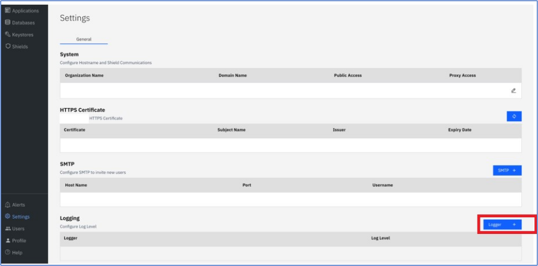
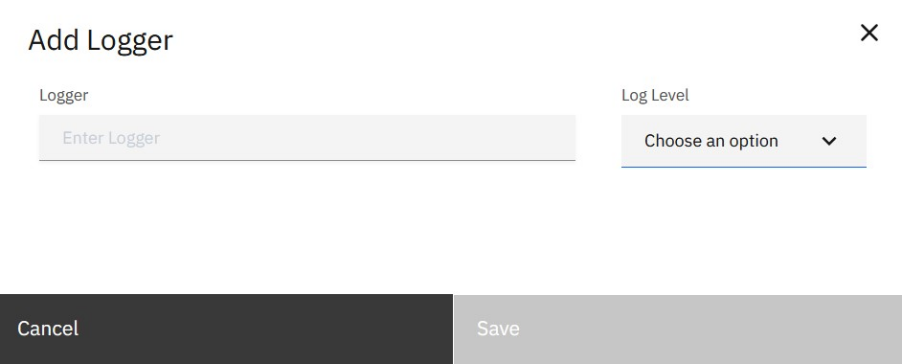

---
copyright:
  years: 2022, 2022
lastupdated: "2022-12-13"

keywords: domain name, host name, https certificate, logger, smtp, settings

subcollection: security-broker
---

# Settings
{: #sb_settings}

## Overview:
{: #sb_settings_overview}

You can use the Settings page to change the basic system settings in the
{{site.data.keyword.security_broker_short}} Manager.

1.  Log into the {{site.data.keyword.security_broker_short}} Manager.

2.  Navigate to the **Settings** icon in the left navigation

3.  Click the **Edit** icon to change the system settings. Modify the
    **Organization name**, and **domain settings**, and click **Save**.

## HTTPS Certificate:
{: #sb_https}

HTTPs Certificate allows you to enable SSL for the {{site.data.keyword.security_broker_short}} Manager console. This ensures that you have secure access to the {{site.data.keyword.security_broker_short}} Manager web interface.

When you try to log into the {{site.data.keyword.security_broker_short}} Manager after the
setup, you get a warning: **Untrusted certificate browser warning**.

**Note**: The warning appears when you have not uploaded an HTTPS
certificate. HTTPS certificate is a digital certificate that
authenticates a website's identity and enables an encrypted connection.

## SMTP:
{: #sb_smtp}

The SMTP configuration is required when you need to add a new user to
the {{site.data.keyword.security_broker_short}} Manager.

Complete the following steps to configure the SMTP credentials for the
{{site.data.keyword.security_broker_short}} Manager:

1.  In the **Settings** page, click **SMTP +** to configure the mail
    server credentials for the {{site.data.keyword.security_broker_short}} Manager.

    {: caption="Figure 1. SMTP in Setttings" caption-side="bottom"}

2.  Specify the following credentials to authenticate to the SMTP server, and click **Save**.
    
       **Host name**: The address where your SMTP server resides
       **Port**: The port number which is used by your server. Usually, the port number is 587 or 2525.
       **Username and Password**:  The credentials for accessing your SMTP server.

    {: caption="Figure 2. SMTP configuration" caption-side="bottom"}
    
    **Note**: This mail server is used to send an invite through email, when you are adding a new user to the {{site.data.keyword.security_broker_short}} Manager.

## Logger:
{: #sb_logger}

Complete the following steps to configure the Logger settings for the
{{site.data.keyword.security_broker_short}} Manager:

1.  In the **Settings** page, click **Logger +** to configure a new logger.

    {: caption="Figure 3. Add Logger" caption-side="bottom"}

2.  Specify a name for the logger according to Java logger naming convention. A dot is used to separate    names, that enforces a hierarchy.
3.  Select a Log Level from the dropdown. These levels define the severity and granularity of the events which is captured by this logger. The options include:
    1. TRACE (Fine-tuned debugging messages)
    2. DEBUG (General debugging messages)
    3. INFO (Informational events)
    4. WARN (Events that might lead to an error)
    5. ERROR (Error messages)

    {: caption="Figure 3. Logger" caption-side="bottom"}

4. Click Save to complete the **Logger** configuraion.

