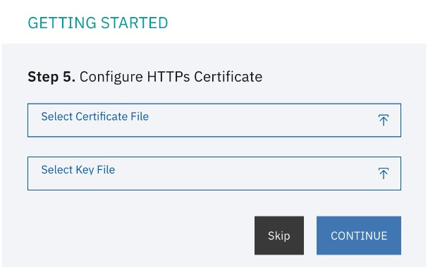

---
copyright:
  years: 2022, 2022
lastupdated: "2022-10-25"

keywords: domain name, host name, https certificate, logger, smtp, settings

subcollection: security-broker
---

# Settings
{: #sb_settings}

## Overview:
{: #sb_settings_overview}

You can use the Settings page to change the basic system settings in the
{{site.data.keyword.security_broker_short}} Manager.

1.  Log into the {{site.data.keyword.security_broker_short}} Manager.

2.  Navigate to the **Settings** icon in the left navigation

3.  Click the **Edit** icon to change the system settings. Modify the
    **Organization name**, and **domain settings**, and click **Save**.

## HTTPS Certificate:
{: #sb_https}

During the configuration, you can Install the SSL Certificate for secure
access to the {{site.data.keyword.security_broker_short}} Manager web interface. Upload the
certificate and key file for your organization to enable SSL for the
{{site.data.keyword.security_broker_short}} Manager console as shown below:

{: caption="Figure 1. HTTPS certificate" caption-side="bottom"}

When you try to log into the {{site.data.keyword.security_broker_short}} Manager after the
setup, you get a warning: **Untrusted certificate browser warning**.

**Note**: The warning appears when you have not uploaded an HTTPS
certificate. HTTPS certificate is a digital certificate that
authenticates a website\'s identity and enables an encrypted connection.

## SMTP:
{: #sb_smtp}

The SMTP configuration is required when you need to add a new user to
the {{site.data.keyword.security_broker_short}} Manager as shown below:

{: caption="Figure 2. SMTP configuration" caption-side="bottom"}

Complete the following steps to configure the SMTP credentials for the
{{site.data.keyword.security_broker_short}} Manager:

1.  Under the **Settings** page, click **SMTP +** to configure the mail
    server credentials for the {{site.data.keyword.security_broker_short}} Manager.

2.  Enter the credentials to use to authenticate to the SMTP server,
    like **Host name**, **Port**, **Username** and **Password**, and
    click **Save**.

3.  This mail server is used to send an invite through email, when
    adding a new user to the {{site.data.keyword.security_broker_short}} Manager.

## Logger:
{: #sb_logger}

Under **Settings** page, you can use the **Logging** section to enable
logging for the {{site.data.keyword.security_broker_short}} Manager. Click **Logger +** to
configure the logging details. Enter a valid logger name and select the
log level. For example, if you wish to log all the errors, select **ERROR** as the
log level as shown below:

{: caption="Figure 3. Logger" caption-side="bottom"}

