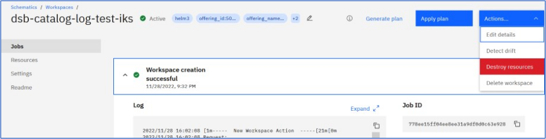

---
copyright:
  years: 2022, 2022
lastupdated: "2022-09-01"

keywords: uninstall, delete, helm, configuration, tls certificate, docker config secret, environment variable, regions, cluster, container, app security, memory encryption, data in use

subcollection: security-broker
---

{:codeblock: .codeblock}
{:screen: .screen}
{:download: .download}
{:external: target="_blank" .external}
{:faq: data-hd-content-type='faq'}
{:gif: data-image-type='gif'}
{:important: .important}
{:note: .note}
{:pre: .pre}
{:tip: .tip}
{:preview: .preview}
{:deprecated: .deprecated}
{:beta: .beta}
{:term: .term}
{:shortdesc: .shortdesc}
{:script: data-hd-video='script'}
{:support: data-reuse='support'}
{:table: .aria-labeledby="caption"}
{:troubleshoot: data-hd-content-type='troubleshoot'}
{:help: data-hd-content-type='help'}
{:tsCauses: .tsCauses}
{:tsResolve: .tsResolve}
{:tsSymptoms: .tsSymptoms}
{:java: .ph data-hd-programlang='java'}
{:javascript: .ph data-hd-programlang='javascript'}
{:swift: .ph data-hd-programlang='swift'}
{:curl: .ph data-hd-programlang='curl'}
{:video: .video}
{:step: data-tutorial-type='step'}
{:tutorial: data-hd-content-type='tutorial'}
{:release-note: data-hd-content-type='release-note'}

# Uninstalling through IBM Cloud Catalog
{: #sb_uninstall}

If you no longer need to use {{site.data.keyword.security_broker_short}}, you can uninstall all the workloads that are associated with the {{site.data.keyword.security_broker_short}} using the IBM Cloud Schematics workspace (https://cloud.ibm.com/schematics/workspaces).
{: shortdesc}

## Pre-requisite:
{: #unistall-prereq}

The user must be aware of the workspace name which is provided during the {{site.data.keyword.security_broker_short}} Manager and {{site.data.keyword.security_broker_short}} Shield installation process.

## Uninstalling {{site.data.keyword.security_broker_short}} Manager:
{: #unistall-sb-IKS}

Log into IBM Cloud Schematics workspace and follow the steps below to uninstall the {{site.data.keyword.security_broker_short}} Manager:

1.  Search for the workspace name that you provided during the {{site.data.keyword.security_broker_short}} Manager install and click on the workspace to open it.

{: caption="IBM Schematicss Workspace" caption-side="bottom"}

2.  Select **Actions** -> **Destroy Resources** to destroy the workloads associated with the {{site.data.keyword.security_broker_short}} Manager.

{: caption="Uninstall {{site.data.keyword.security_broker_short}} Manager" caption-side="bottom"}

3. Follow the same process for the {{site.data.keyword.security_broker_short}} Shield to uninstall the workloads associated with the {{site.data.keyword.security_broker_short}} Shield. Remember to work with the correct workspace name, which is provided during the {{site.data.keyword.security_broker_short}} Shield install.

Once you uninstall the {{site.data.keyword.security_broker_short}} Manager and {{site.data.keyword.security_broker_short}} Shield workloads, you can see that the pods are being terminated and you can monitor the successfull uninstall operation through the logs.
