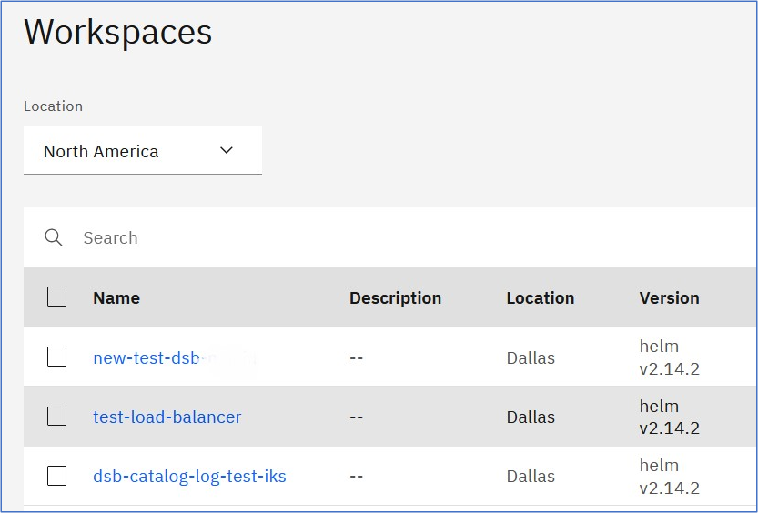
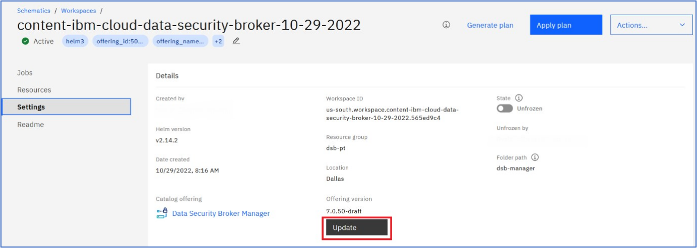
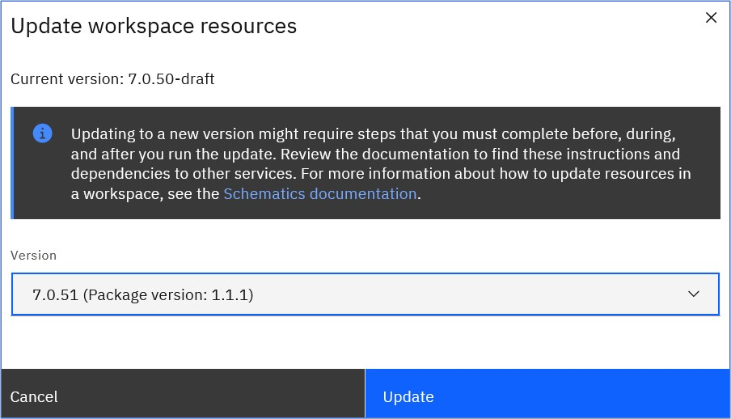

---
copyright:
  years: 2022, 2022
lastupdated: "2022-09-01"

keywords: upgrade, delete, helm, configuration, tls certificate, docker config secret, environment variable, regions, cluster, container, app security, memory encryption, data in use

subcollection: security-broker
---

# Upgrading using IBM Cloud Catalog
{: #sb_update}

After {{site.data.keyword.security_broker_short}} is installed on your cluster, you can upgrade it at any time using the IBM Cloud Schematics workspace (https://cloud.ibm.com/schematics/workspaces)
{: shortdesc}

## Pre-requisite:
{: #upgrade-prereq}

The user must be aware of the workspace name which is provided during the {{site.data.keyword.security_broker_short}} Manager and {{site.data.keyword.security_broker_short}} Shield installation process.

## Upgrading {{site.data.keyword.security_broker_short}} Manager:
{: #upgrade-sb-ROKS}

Log into IBM Cloud Schematics workspace and follow the steps below to upgrade the {{site.data.keyword.security_broker_short}} Manager version:

1.  Search for the workspace name that you provided during the {{site.data.keyword.security_broker_short}} Manager install and click on the workspace to open it.

    {: caption="IBM Schematicss Workspace" caption-side="bottom"}

2.  Click **Settings** option in the left navigation.

    {: caption="{{site.data.keyword.security_broker_short}} Manager Upgrade" caption-side="bottom"}

3. If the new version is available for the {{site.data.keyword.security_broker_short}} Manager, then the **Update** button is enabled and you can click the **Update** button to proceed with upgrading the {{site.data.keyword.security_broker_short}} Manager.

4. In the **Update Workspace resources** window, select the version of the {{site.data.keyword.security_broker_short}} Manager, which you wish to upgrade to, and click **Update**.

    {: caption="{{site.data.keyword.security_broker_short}} Manager Version" caption-side="bottom"}

**Note**: Once you click **Update**, IBM Cloud Schematics runs the terraform code in the backend to execute the newer version of the {{site.data.keyword.security_broker_short}} Manager from the IBM Cloud Helm Catalog. After the upgrade is complete, the pods are refreshed in the namespace where you have upgraded the {{site.data.keyword.security_broker_short}} Manager.

5. Follow the same process to proceed with upgrading the {{site.data.keyword.security_broker_short}} Shield. Remember to work with the correct workspace name, which is provided during the {{site.data.keyword.security_broker_short}} Shield install.

**Note**: Once the {{site.data.keyword.security_broker_short}} Shield upgrade completes, based on the prior Shield Sync ID, new {{site.data.keyword.security_broker_short}} Shield instances is automatically picked up by the enrolled application in {{site.data.keyword.security_broker_short}} Manager.

Once the upgrade operation is successfull, the pods will come to **Running** state in the target cluster.

